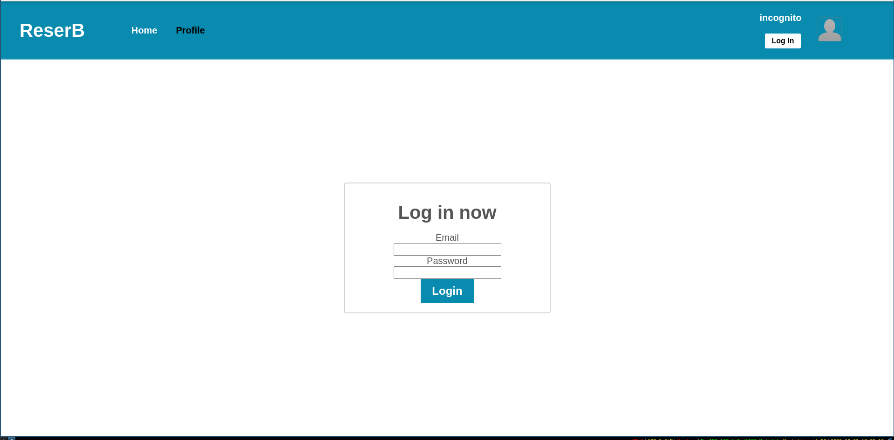
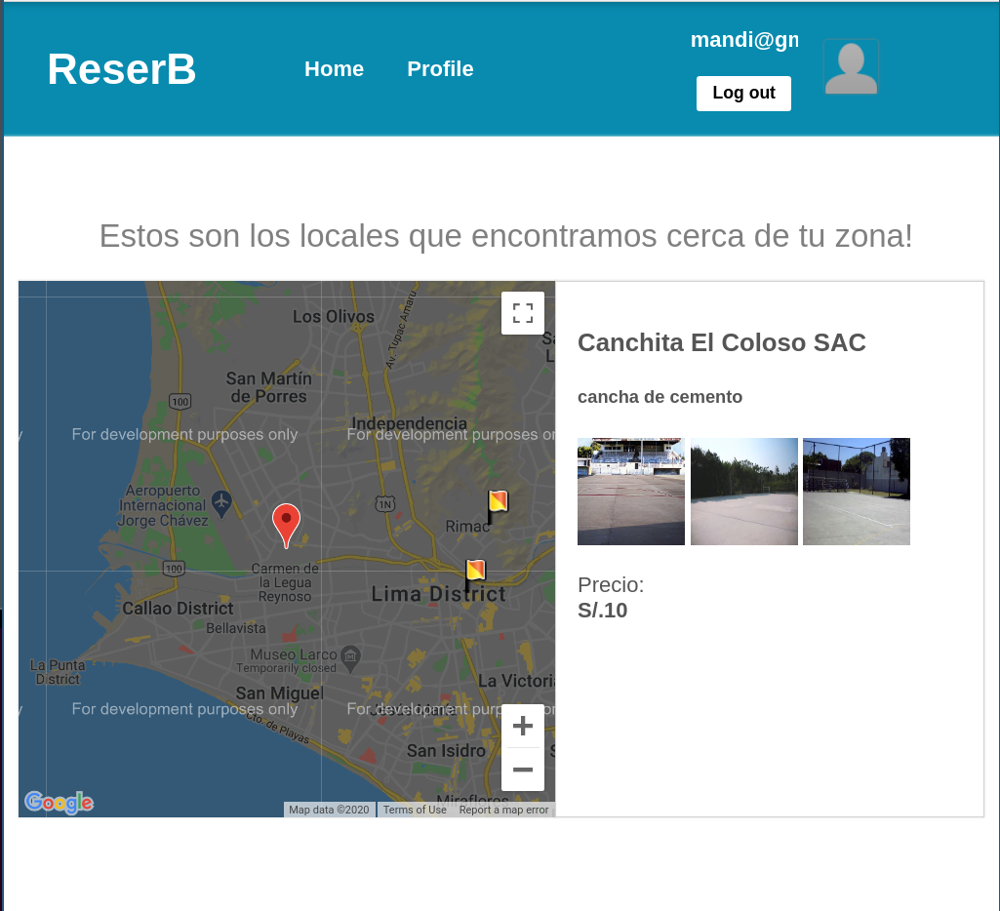

## Reser-B Client

cliente para el software de reservas reserb




### Installation

copy the repository
and move to base path

```bash
    cd repo/
    npm i
```

### Usage

```bash
    npm start
```

### Contributing

Pull requests are welcome. For major changes, please open an issue first to discuss what you would like to change.

Please make sure to update tests as appropriate.

### Licence

[MIT](https://choosealicense.com/licenses/mit/)
